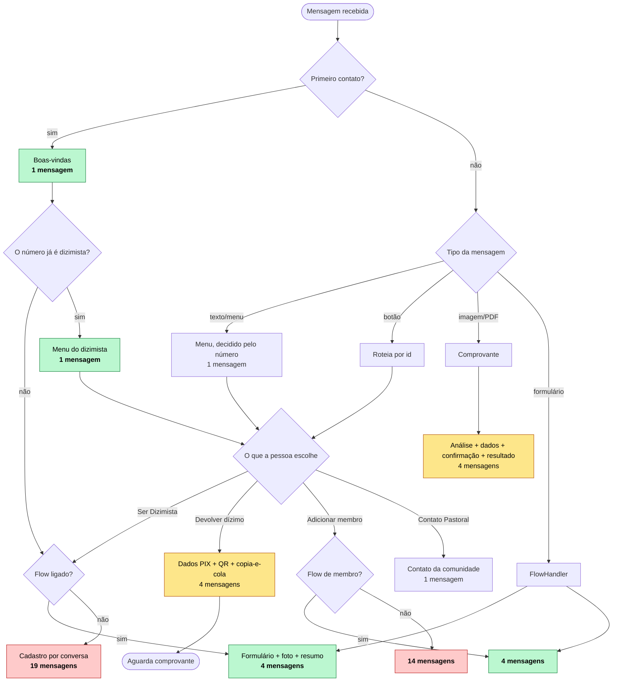
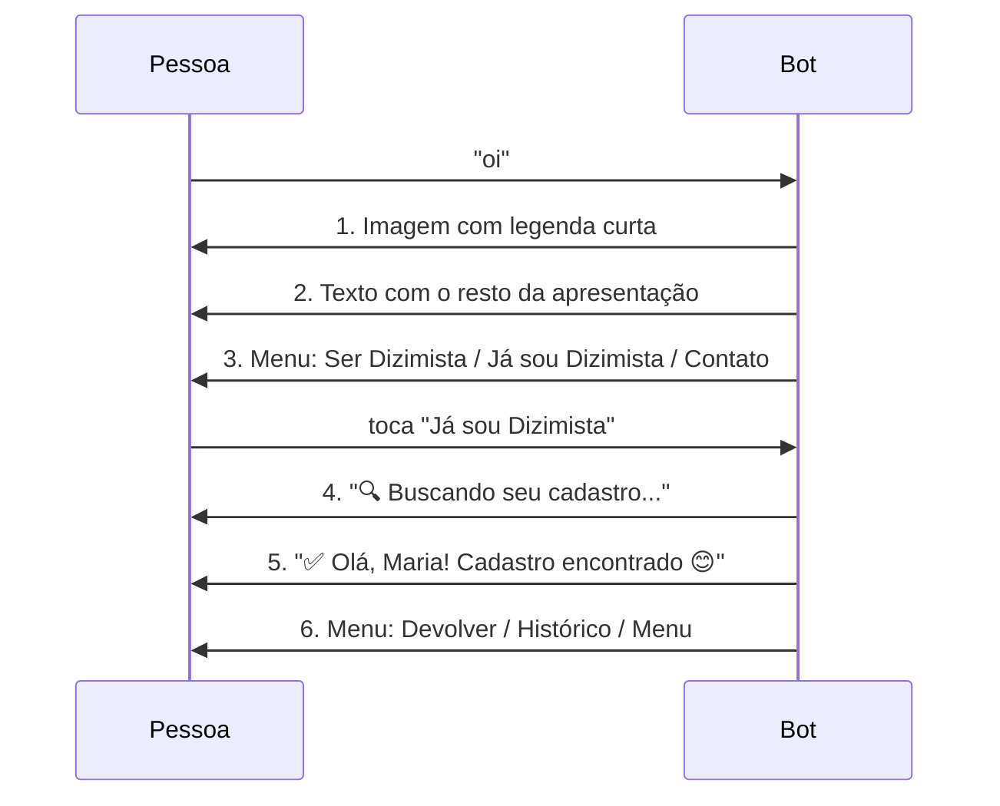
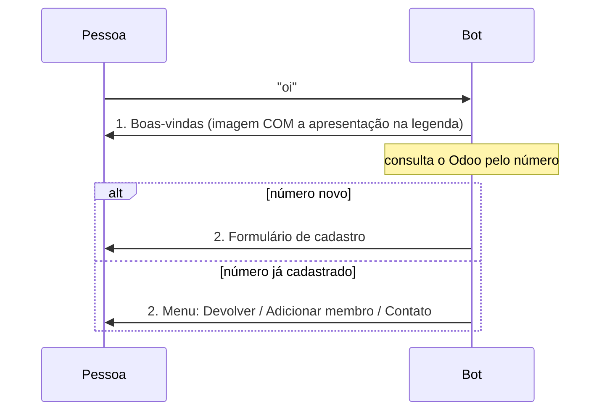
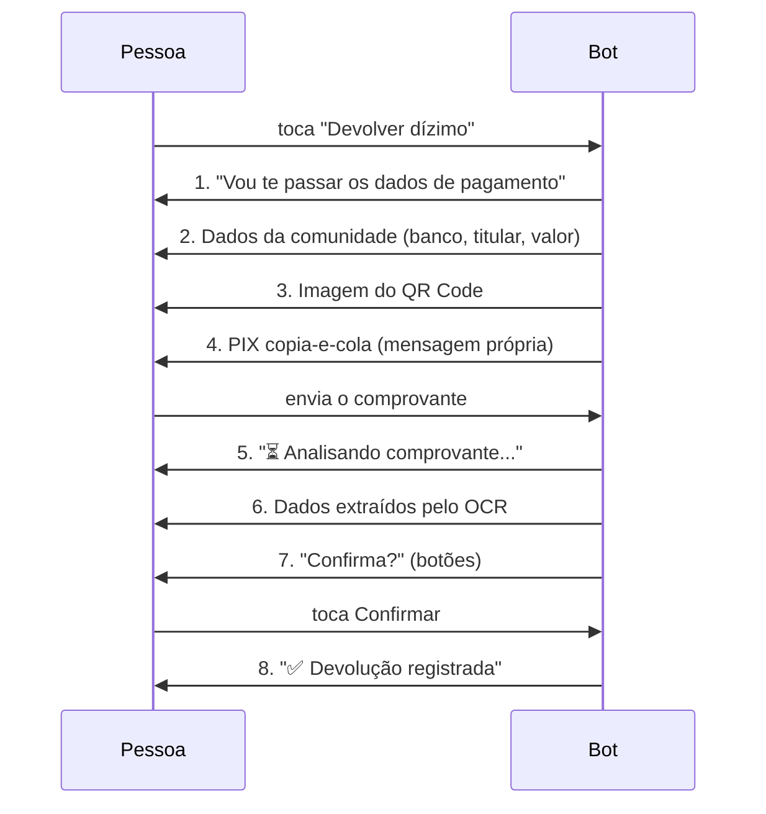

# Fluxos do bot e o custo de cada um

*Levantado em 18/09/2026, contando as chamadas de envio no código — não por estimativa.*

Este documento existe por causa de uma preocupação concreta: **a partir de 1º de
outubro de 2026 a Meta cobra as mensagens de serviço acima de 1.000 por mês**, e
é preciso saber de onde elas saem antes de decidir o que cortar.

A regra que vale para tudo aqui: **mensagem recebida é grátis; o que custa é a
resposta do bot.** Então o número que importa em cada fluxo é quantas mensagens
o bot envia, não quantas trocas acontecem.

---

## 1. Resumo — quantas mensagens cada fluxo custa

| Fluxo | Mensagens do bot | Frequência esperada |
|---|---|---|
| Primeiro contato (boas-vindas + próximo passo) | **2** | uma vez por pessoa |
| Cadastro por conversa | **19** | uma vez por pessoa |
| Cadastro por formulário (Flow) | **4** | uma vez por pessoa |
| Adicionar membro por conversa | **14** | raro |
| Adicionar membro por formulário | **4** | raro |
| **Devolução do dízimo** | **8** | **a mais frequente** |
| Lembrete mensal (template) | **1** | uma vez por mês, por pessoa |
| Relatório do coordenador | 4 a 12 | poucas pessoas |

⚠️ **O cadastro por conversa estava sendo subestimado** em análises anteriores
deste projeto, que falavam em "~15". A contagem passo a passo dá **19**, e 21
somando as boas-vindas para quem chega do zero.

Os números desta tabela são conferidos no código por
`node ferramentas/conta-mensagens.js` — veja a seção 7.

---

## 2. O fluxo completo, em desenho



**A entrada decide pelo número, não pela pessoa.** O WhatsApp entrega o
telefone em toda mensagem, então perguntar "você já é dizimista?" é pedir uma
informação que o bot já tem. Ver seção 3.

Em amarelo, a devolução — **o único fluxo que se repete todo mês**. Em vermelho,
os caminhos por conversa. Em verde, os por formulário.

---

## 3. A entrada — a mudança que vale para todo mundo

Toda pessoa passa por aqui, cadastrada ou não, uma vez ou todo mês. Era onde
mais se gastava mensagem sem entregar nada.

### Como era: 4 mensagens até a primeira escolha útil



Seis mensagens para uma dizimista cadastrada chegar ao botão de devolver. Três
delas — o "Buscando", o "Cadastro encontrado" e o menu que as pediu — existiam
para descobrir **pelo número** algo que o número já dizia: o WhatsApp entrega o
telefone em toda mensagem recebida, e é por ele que o Odoo é consultado. O bot
perguntava à pessoa quem ela era para depois ignorar a resposta e consultar o
telefone.

### Como é: 2 mensagens, e a segunda já é o próximo passo



Três mudanças, nenhuma delas tira informação da tela:

| Mudança | Antes | Agora |
|---|---|---|
| Boas-vindas | imagem + texto, 2 mensagens | imagem **com legenda**, 1 mensagem |
| Menu de entrada | genérico, igual para todos | decidido pelo número |
| Identificação | 3 mensagens | nenhuma — o número basta |

**6 → 2 para quem já é dizimista. 4 → 2 para quem é novo.**

### O histórico, que não coube

O WhatsApp aceita **no máximo 3 botões** por menu. Devolver, Adicionar membro e
Contato Pastoral já ocupam os três, e o histórico ficou de fora. Em vez de
gastar uma quarta mensagem com ele, ele virou **uma linha dentro da devolução**:

```
📊 Sua última devolução: R$ 150,00 em 12/08/2026
_Digite *histórico* para ver as anteriores._
```

Aparece onde a pessoa já está pensando em dízimo, custa zero mensagem a mais —
vai na mensagem de dados de pagamento que já seria enviada — e a palavra
`histórico` continua funcionando como atalho em qualquer ponto da conversa.

### Os botões antigos continuam vivos

`btn_ja_sou_dizimista` e `btn_minhas_devolucoes` saíram dos menus, mas as
mensagens antigas seguem na conversa de cada pessoa e o toque nelas chega ao
webhook normalmente. Os dois ids continuam atendidos no `Router.gs` — só que
`btn_ja_sou_dizimista` agora leva direto ao menu do dizimista, sem a
identificação. Remover os `case` transformaria um botão antigo em silêncio.

---

## 4. Devolução do dízimo — o fluxo que pesa

É o único recorrente. Tudo o mais acontece uma vez por pessoa, ou quase nunca.



**8 mensagens.** Se a pessoa chegar pelo menu em vez do botão do lembrete, 9 —
e eram 12 antes da seção 3: o menu genérico, o "Já sou Dizimista" e as duas
mensagens de identificação ficavam no caminho de quem só queria devolver.

### Onde estão os cortes, e o que cada um custa em usabilidade

| # | Mensagem | Dá para cortar? |
|---|---|---|
| 1 | "Vou te passar os dados" | **Sim** — juntar com a 2. É anúncio do que vem na mensagem seguinte |
| 2 | Dados da comunidade | Não |
| 3 | Imagem do QR Code | **Sim** — quem paga pelo celular usa o copia-e-cola; o QR serve para quem lê de outra tela |
| 4 | PIX copia-e-cola | Não — é o que a pessoa efetivamente usa |
| 5 | "⏳ Analisando..." | **Sim** — é feedback de progresso. Sem ela a pessoa espera alguns segundos sem retorno |
| 6 | Dados extraídos | **Sim** — juntar com a 7, que já os repete |
| 7 | "Confirma?" | Não |
| 8 | Resultado | Não |

**8 → 4 mensagens** cortando as quatro. Nenhum corte remove informação: três são
fusões e um é o QR, que duplica o copia-e-cola.

---

## 5. Cadastro — por conversa e por formulário

### Por conversa: 19 mensagens

| # | Mensagem |
|---|---|
| 1 | Confirmar o número |
| 2 | Lista de comunidades |
| 3 | "Ótimo! Comunidade X ✅" |
| 4 | "Nome completo" |
| 5 | "Prazer! Como quer ser chamado?" |
| 6 | "Certo. Data de nascimento" |
| 7 | "Data registrada ✅" |
| 8 | "Endereço" |
| 9 | "Valor mensal" |
| 10 | "Valor registrado ✅" |
| 11 | "Quer receber lembretes?" |
| 12 | "Perfeito. Qual dia?" |
| 13 | "✅ Lembrete no dia X" |
| 14 | "📸 Foto de perfil" |
| 15 | "⏳ Processando foto..." |
| 16 | "✅ Foto recebida!" |
| 17 | Resumo + Confirmar/Corrigir |
| 18 | "⏳ Salvando seu cadastro..." |
| 19 | "🎉 Cadastro realizado!" |

Repare no padrão: **7 das 19 são confirmações do tipo "X registrado ✅"**,
sempre seguidas da pergunta seguinte. Cada par poderia ser uma mensagem só —
o que levaria 19 a 12 sem tirar nada da tela.

### Por formulário: 4 mensagens

| # | Mensagem |
|---|---|
| 1 | Mensagem que abre o formulário |
| 2 | "Recebi seus dados! Envie uma foto" |
| 3 | Resumo + Confirmar/Corrigir |
| 4 | "🎉 Cadastro realizado!" |

A resposta do formulário é **mensagem recebida — não é cobrada**. Os 8 campos
chegam de graça.

---

## 6. O que isso dá em dinheiro

Cenário da paróquia: **500 dizimistas, 500 devoluções por mês**.

Tarifa Brasil, mensagem de serviço: **R$ 0,035**. Franquia: **1.000/mês**, a
partir de 01/10/2026. Template não tem franquia — é cobrado desde o primeiro.

### Hoje, como está

| Item | Contas | Mensagens |
|---|---|---|
| Devoluções | 500 × 8 | 4.000 |
| Lembretes (template) | 500 × 1 | 500 |

- Serviço: 4.000 − 1.000 de franquia = 3.000 × R$ 0,035 = **R$ 105,00**
- Template: 500 × R$ 0,035 = **R$ 17,50**
- **Total: R$ 122,50/mês** (R$ 1.470/ano)

### Com os quatro cortes da devolução

| Item | Contas | Mensagens |
|---|---|---|
| Devoluções | 500 × 4 | 2.000 |
| Lembretes | 500 × 1 | 500 |

- Serviço: 2.000 − 1.000 = 1.000 × R$ 0,035 = **R$ 35,00**
- Template: **R$ 17,50**
- **Total: R$ 52,50/mês** (R$ 630/ano)

**A conta cai 57%.** E o custo por pessoa por ano sai de R$ 2,94 para R$ 1,26.

### O mês da adesão

Se os 500 se cadastrarem no mesmo mês, some os cadastros uma vez:

| Item | Mensagens | Custo do mês |
|---|---|---|
| Cadastro por conversa (19) | +9.500 | ≈ R$ 455 |
| Cadastro por formulário (4) | +2.000 | ≈ R$ 122 |
| Entrada, antes da seção 3 (4 por pessoa) | +2.000 | ≈ R$ 70 |
| Entrada, agora (2 por pessoa) | +1.000 | ≈ R$ 35 |

É evento único, mas é o pico. **O formulário economiza ~R$ 330 só nesse mês, e
a entrada unificada, mais R$ 35.**

A entrada é cobrada uma vez por pessoa, então não muda a conta do mês a mês —
o que ela muda todo mês são as duas mensagens de identificação que sumiram do
caminho de quem chega à devolução pelo menu.

---

## 7. Conclusão, sem rodeio

**Não fica inviável.** No pior caso de hoje, R$ 122,50/mês — pouco mais de
R$ 1.400 por ano para 500 famílias. Com os cortes da seção 4, cai para
R$ 52,50/mês sem perder nada na tela.

O que muda a ordem de grandeza não é o cadastro, e sim a **devolução**: ela é a
única que se repete. Cortar uma mensagem da devolução vale 500 mensagens por
mês; cortar uma do cadastro vale 500 uma única vez na vida da paróquia.

**A ordem de prioridade, por retorno:**

1. **Fundir as quatro mensagens da devolução** — R$ 70/mês, sem perda
2. **Manter o formulário ligado** — já feito; evita o pico da adesão
3. **Entrada unificada** — já feito; corta o pico da adesão e as duas mensagens
   de identificação de quem chega à devolução pelo menu
4. Reduzir o cadastro por conversa — só vale para quem não usa o formulário

**O que não vale a pena mexer:** o lembrete mensal. São 500 templates a
R$ 17,50 no total, e é ele que traz a pessoa de volta — cortá-lo economiza
pouco e custa a devolução inteira.

---

## 8. Como conferir estes números na sua instância

```
verificarConsumoMensagens()    // Setup.gs, no editor do Apps Script
```

Mostra serviço e template do mês corrente e projeta o fechamento. O contador é
alimentado por `Utils.fetchComRetry`, que marca cada entrega aceita pela Meta —
então mede o que é cobrado, não o que o código pretendia enviar.

Rode antes e depois de um bloco de testes para medir um fluxo isolado.

### Conferir a contagem deste documento, sem enviar nada

```
node ferramentas/conta-mensagens.js
```

Carrega os `.gs` de verdade e troca só a borda — nada sai pela rede, nada toca o
Odoo. Conta quantas mensagens cada entrada dispara e compara com a tabela da
seção 1; sai com código 1 se divergir.

Existe porque número em documento envelhece calado: basta alguém acrescentar um
`Utils.enviarSimples` para esta página passar a mentir sem que nada falhe.
