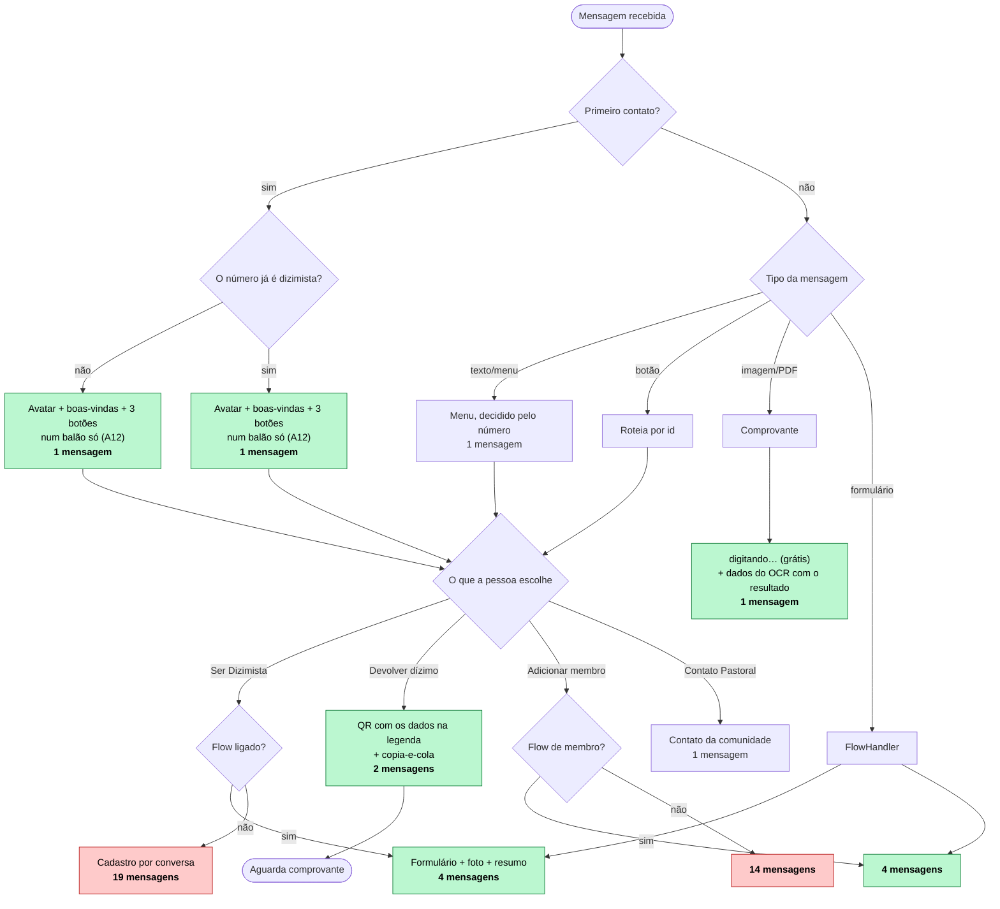
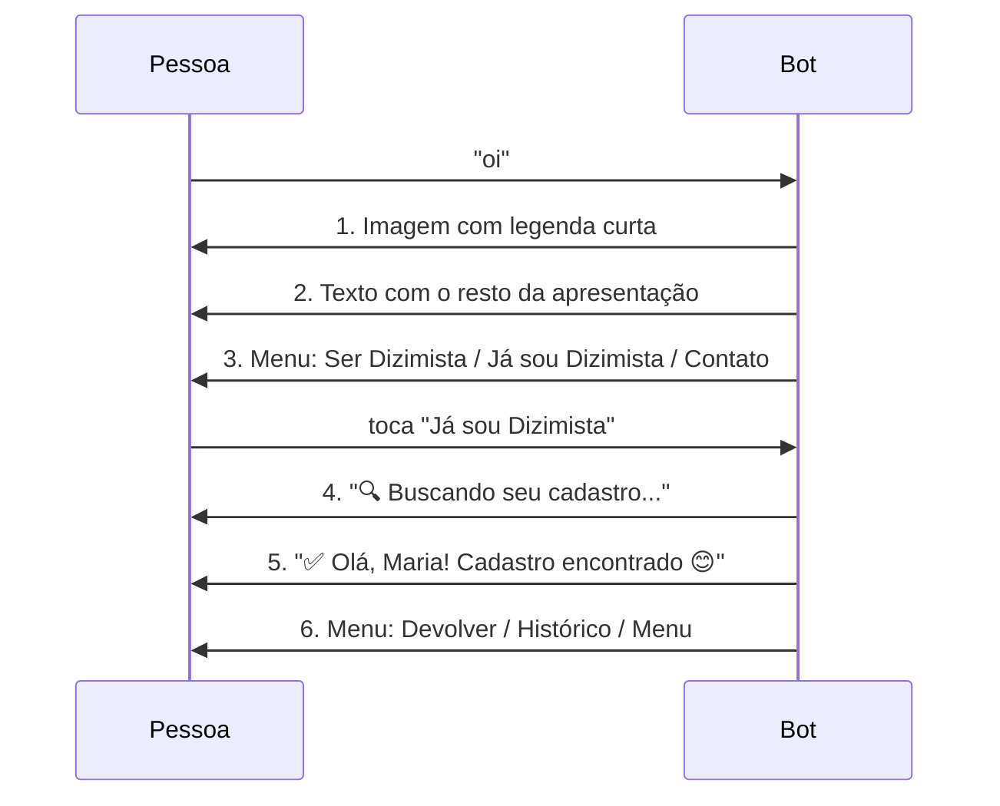
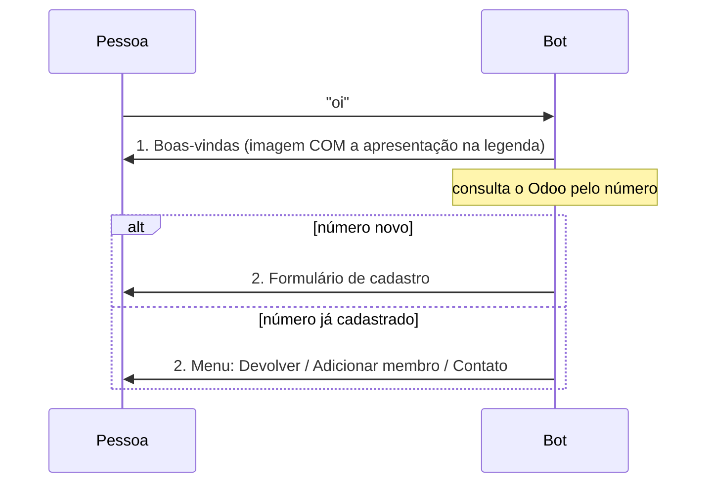
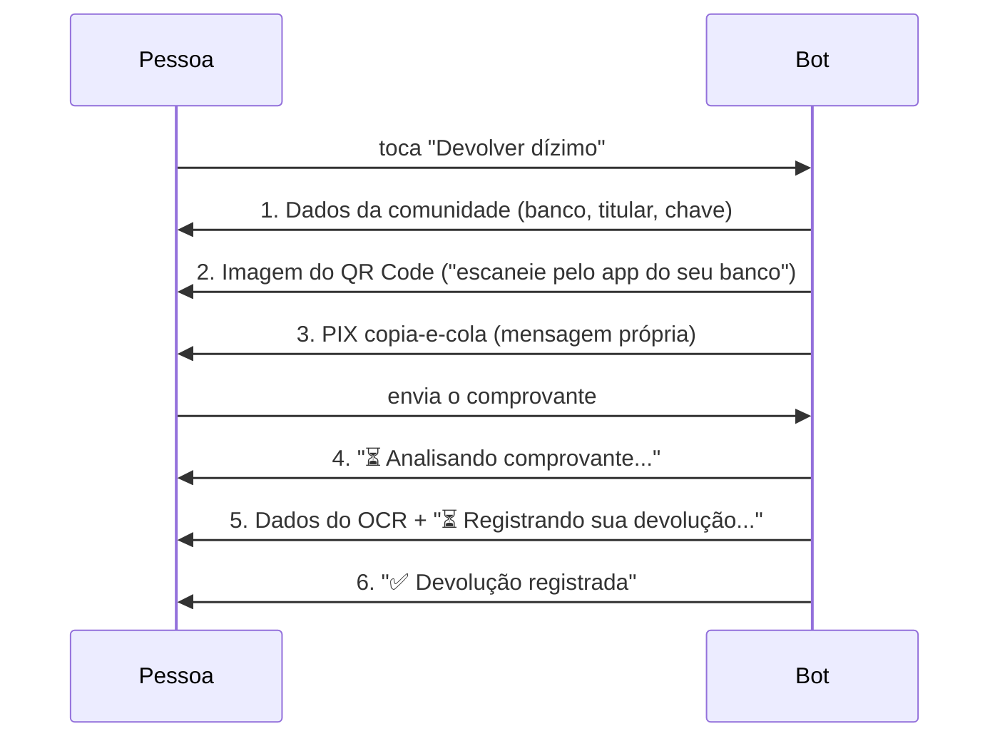
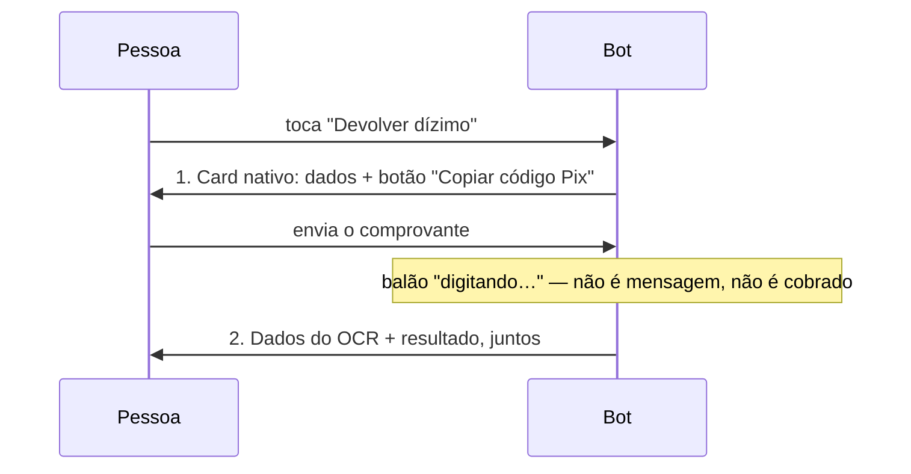
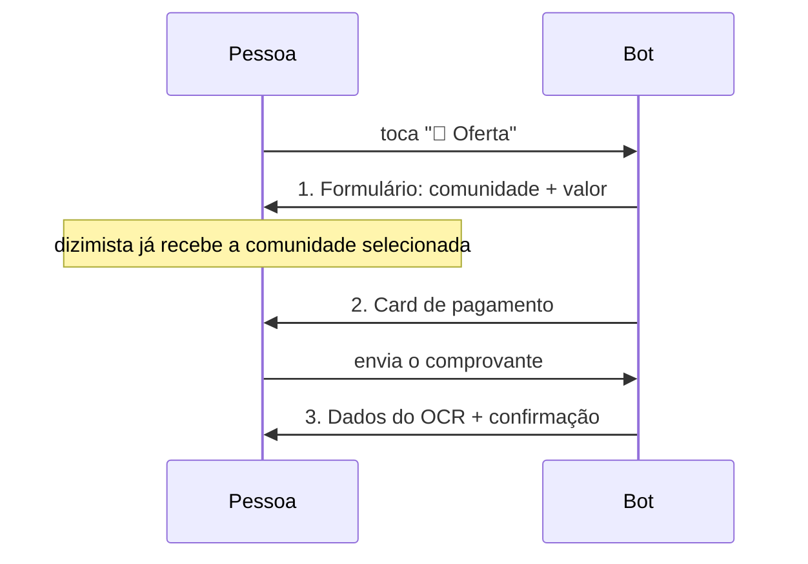

# Fluxos do bot e o custo de cada um

*Levantado em 18/09/2026. Os fluxos de entrada e devolução são contados
executando o código (`node ferramentas/conta-mensagens.js`); os de cadastro,
lendo-o. A distinção importa — ver o fim da seção 1.*

Este documento existe por causa de uma preocupação concreta: **a partir de 1º de
outubro de 2026 a Meta cobra as mensagens de serviço acima de 1.000 por mês**, e
é preciso saber de onde elas saem antes de decidir o que cortar.

A regra que vale para tudo aqui: **mensagem recebida é grátis; o que custa é a
resposta do bot.** Então o número que importa em cada fluxo é quantas mensagens
o bot envia, não quantas trocas acontecem.

---

## 1. Resumo — quantas mensagens cada fluxo custa

| Fluxo | Mensagens do bot | Frequência esperada |
|---|---|---|
| Primeiro contato (dizimista ou número novo) | **1** | uma vez por pessoa |
| Cadastro por conversa | **19** | uma vez por pessoa |
| Cadastro por formulário (Flow) | **4** | uma vez por pessoa |
| Adicionar membro por conversa | **14** | raro |
| Adicionar membro por formulário | **4** | raro |
| **Devolução do dízimo** | **2** | **a mais frequente** |
| Oferta (por formulário) | **3** | ocasional |
| Oferta (por conversa, sem cadastro) | **5** | ocasional |
| Contato Pastoral (pelo submenu) | **2** | ocasional |
| Convidar alguém (cartão do bot + texto) | **2** | ocasional |
| Lembrete mensal (template) | **1** | uma vez por mês, por pessoa |
| Relatório do coordenador | 4 a 12 | poucas pessoas |

### De onde vem cada número, e quais já erraram

Os fluxos de **entrada** e de **devolução** são conferidos no código a cada
execução de `node ferramentas/conta-mensagens.js` (seção 9). Os de **cadastro**
são contados lendo o código, e já erraram duas vezes:

- o cadastro por conversa foi dado como "~15" em análises anteriores deste
  projeto; a contagem passo a passo dá **19**;
- a devolução foi documentada aqui mesmo como **8**, em 18/09, listando uma
  mensagem de abertura ("Vou te passar os dados") e uma de confirmação
  ("Confirma?") que **não existem** no caminho individual. O harness, escrito
  depois, executou o fluxo e contou **6**. Foi por isso que ele passou a cobrir
  a devolução: contar lendo é exatamente o que falhou.

Os números de cadastro, portanto, merecem a mesma desconfiança até que o
harness os cubra.

---

## 2. O fluxo completo, em desenho



**A entrada decide pelo número, não pela pessoa.** O WhatsApp entrega o
telefone em toda mensagem, então perguntar "você já é dizimista?" é pedir uma
informação que o bot já tem. Ver seção 3.

Em verde, o que já foi enxugado. Em vermelho, os caminhos por conversa, que
sobrevivem para quem desiste do formulário ou está num aparelho que não o
renderiza — e são os únicos que ainda custam caro.

A **devolução** é o único fluxo que se repete todo mês. Hoje são 3 mensagens:
2 para pagar, 1 para confirmar. Ver seção 4.

---

## 3. A entrada — a mudança que vale para todo mundo

Toda pessoa passa por aqui, cadastrada ou não, uma vez ou todo mês. Era onde
mais se gastava mensagem sem entregar nada.

### Como era: 4 mensagens até a primeira escolha útil



Seis mensagens para uma dizimista cadastrada chegar ao botão de devolver. Três
delas — o "Buscando", o "Cadastro encontrado" e o menu que as pediu — existiam
para descobrir **pelo número** algo que o número já dizia: o WhatsApp entrega o
telefone em toda mensagem recebida, e é por ele que o Odoo é consultado. O bot
perguntava à pessoa quem ela era para depois ignorar a resposta e consultar o
telefone.

### Como é: 2 mensagens, e a segunda já é o próximo passo



Três mudanças, nenhuma delas tira informação da tela:

| Mudança | Antes | Agora |
|---|---|---|
| Boas-vindas | imagem + texto, 2 mensagens | imagem **com legenda**, 1 mensagem |
| Menu de entrada | genérico, igual para todos | decidido pelo número |
| Identificação | 3 mensagens | nenhuma — o número basta |

**6 → 2 para quem já é dizimista. 4 → 2 para quem é novo.**

### O histórico, que não coube

O WhatsApp aceita **no máximo 3 botões** por menu. Devolver, Adicionar membro e
Contato Pastoral já ocupam os três, e o histórico ficou de fora. Em vez de
gastar uma quarta mensagem com ele, ele virou **uma linha dentro da devolução**:

```
📊 Sua última devolução: R$ 150,00 em 12/08/2026
_Digite *histórico* para ver as anteriores._
```

Aparece onde a pessoa já está pensando em dízimo, custa zero mensagem a mais —
vai na mensagem de dados de pagamento que já seria enviada — e a palavra
`histórico` continua funcionando como atalho em qualquer ponto da conversa.

### Os botões antigos continuam vivos

`btn_ja_sou_dizimista` e `btn_minhas_devolucoes` saíram dos menus, mas as
mensagens antigas seguem na conversa de cada pessoa e o toque nelas chega ao
webhook normalmente. Os dois ids continuam atendidos no `Router.gs` — só que
`btn_ja_sou_dizimista` agora leva direto ao menu do dizimista, sem a
identificação. Remover os `case` transformaria um botão antigo em silêncio.

---

## 4. Devolução do dízimo — o fluxo que pesa

É o único recorrente. Tudo o mais acontece uma vez por pessoa, ou quase nunca.
Cortar uma mensagem aqui vale 500 por mês; no cadastro, vale 500 uma única vez
na vida da paróquia.

### Como era: 6 mensagens



### Como é: 2 mensagens



O passo intermediário — QR numa mensagem, copia-e-cola noutra — caiu com o
**BL-40**: o card `order_details` do WhatsApp carrega o texto **e** um botão
nativo de copiar. Ver a seção logo abaixo.

| # | O que era | O que virou | Perdeu algo? |
|---|---|---|---|
| 1+2 | Dados numa mensagem, QR noutra com legenda genérica | **Dados na legenda do QR** | Não. A legenda dizia "escaneie pelo app do banco" — o óbvio — enquanto uma mensagem cobrada carregava os dados |
| 3 | PIX copia-e-cola | **Virou o botão nativo do card** (BL-40) | Só o QR escaneável |
| 4 | "⏳ Analisando comprovante..." | **Indicador de digitação** | Não. Melhora: balão vivo no lugar de linha parada, e de graça |
| 5+6 | Dados do OCR, depois o resultado | **Uma mensagem só** | Não. O resultado já repetia valor e data |

**6 → 3 mensagens.** Três fusões, zero informação removida da tela, e o QR Code
— que a proposta original mandava cortar — continua lá.

### O card nativo, e o que ele custou (BL-40)

O copia-e-cola era a única mensagem que existia para ser **copiada inteira**:
um toque longo → Copiar precisava levar exatamente o código EMV, e qualquer
texto em volta entraria na cópia e o banco recusaria. Fundi-lo por conta
própria economizaria uma mensagem e quebraria o pagamento.

O WhatsApp resolve isso de dentro: a mensagem `order_details` traz um **botão
nativo "Copiar código Pix"**. Uma sonda (19/09) confirmou que a Meta aceita o
BR Code que o próprio bot gera — **sem PSP, sem tarifa, dinheiro caindo direto
na conta da comunidade**, apesar de o campo se chamar `pix_dynamic_code`.

**O que se perdeu:** o QR Code escaneável. Quem pagava lendo de outra tela — um
computador, ou alguém pagando pelo celular de outra pessoa — não tem mais a
imagem. Foi uma troca consciente: quem paga no próprio aparelho, que é a
maioria, ganha um botão que nem depende de toque longo.

**O que NÃO mudou:** a conciliação. Saber que o pagamento aconteceu continua
exigindo PSP (R$ 150–500/mês, ver BL-40), então o comprovante e o OCR ficam.

**Rede de segurança:** esta é a mensagem por onde o dinheiro passa. Se a Meta
recusar o card por qualquer motivo, o código cai sozinho na reserva — dados de pagamento
+ copia-e-cola, sem o QR desde o BL-84 (ele ia para um serviço de terceiros) —, que continua inteiro. Custa 2 mensagens a mais e é o preço
certo a pagar. O harness cobre os dois caminhos.

### O indicador de digitação, e o que acontece se ele falhar

O `⏳ Analisando...` era uma mensagem de serviço, cobrada, cujo conteúdo é
"estou trabalhando". O endpoint de marcar-como-lida da Cloud API aceita um
`typing_indicator` junto — **não é uma mensagem**, não entra na franquia de
1.000/mês.

Duas ressalvas honestas:

- O balão some após ~25 s. Se o OCR mais o Odoo passarem disso, a pessoa fica
  sem sinal — o mesmo que já acontecia depois do "Analisando..." antigo, que
  também não se repetia.
- Se a Meta recusar a chamada, `sinalizarProcessando` devolve `false` e **o
  texto volta**. O corte é grátis quando funciona e inofensivo quando não. Vale
  conferir no Cloud Logging, depois do deploy, se aparece
  `⚠️ [WhatsApp] Indicador de digitação recusado`.

O mesmo tratamento foi aplicado ao `⏳ Salvando seu cadastro...`.

---

## 5. Cadastro — por conversa e por formulário

### Por conversa: 19 mensagens

| # | Mensagem |
|---|---|
| 1 | Confirmar o número |
| 2 | Lista de comunidades |
| 3 | "Ótimo! Comunidade X ✅" |
| 4 | "Nome completo" |
| 5 | "Prazer! Como quer ser chamado?" |
| 6 | "Certo. Data de nascimento" |
| 7 | "Data registrada ✅" |
| 8 | "Endereço" |
| 9 | "Valor mensal" |
| 10 | "Valor registrado ✅" |
| 11 | "Quer receber lembretes?" |
| 12 | "Perfeito. Qual dia?" |
| 13 | "✅ Lembrete no dia X" |
| 14 | "📸 Foto de perfil" |
| 15 | "⏳ Processando foto..." |
| 16 | "✅ Foto recebida!" |
| 17 | Resumo + Confirmar/Corrigir |
| 18 | "⏳ Salvando seu cadastro..." |
| 19 | "🎉 Cadastro realizado!" |

Repare no padrão: **7 das 19 são confirmações do tipo "X registrado ✅"**,
sempre seguidas da pergunta seguinte. Cada par poderia ser uma mensagem só —
o que levaria 19 a 12 sem tirar nada da tela.

A número 18 já saiu: virou o indicador de digitação, junto com o
"⏳ Analisando..." da devolução (seção 4).

### Por formulário: 4 mensagens

| # | Mensagem |
|---|---|
| 1 | Mensagem que abre o formulário |
| 2 | "Recebi seus dados! Envie uma foto" |
| 3 | Resumo + Confirmar/Corrigir |
| 4 | "🎉 Cadastro realizado!" — **com os botões de dizimista** |

### A confirmação do cadastro é o menu

A mensagem 4 trazia um botão só, `🔙 Menu`. Quem quisesse devolver na hora —
que é o motivo de ter se cadastrado — tocava em Menu, o bot mandava o menu
(**uma mensagem cobrada**) e só então ela tocava em "Devolver dízimo".

Os três botões do menu de dizimista cabem nessa mensagem, que sai de qualquer
forma. Então a mensagem do menu deixou de existir:

```
🎉 Cadastro realizado com sucesso!
Bem-vindo(a), Thalles! 💛
…
┌──────────────────────┐
│ 💰 Devolver dízimo   │
│ ➕ Adicionar membro  │
│ 📞 Contato Pastoral  │
└──────────────────────┘
```

**Custa zero e economiza 1 mensagem por cadastro** — e o mesmo vale para a
confirmação de "membro adicionado", que tinha o mesmo botão solitário.

Os três botões vivem em `MenuHandler.botoesDizimista()`, num lugar só, porque
agora aparecem em três telas. Espalhados, divergiriam — foi exatamente o que
tinha acontecido antes do BL-38, quando o menu de "já sou dizimista" trazia um
conjunto diferente do menu principal. O harness compara as três.

A resposta do formulário é **mensagem recebida — não é cobrada**. Os 8 campos
chegam de graça.

---

## 5b. Oferta — o primeiro fluxo sem cadastro (BL-41)

A oferta é contribuição avulsa: recolhida na missa, sem valor mensal e **sem
exigir cadastro**. É o único caminho do bot que atende quem ele nunca viu.

### O que ela compartilha com o dízimo, e o que não

| | Dízimo | Oferta |
|---|---|---|
| Valor | do cadastro | a pessoa informa |
| Comunidade | do cadastro | **a pessoa escolhe, sempre** |
| Precisa ser dizimista | sim | **não** |
| Pagamento | card do BL-40 | o mesmo |
| Comprovante e OCR | sim | o mesmo |
| Onde grava | `x_devolucao` | `x_devolucao`, com `tipo = oferta` |

### Por formulário: 3 mensagens



### A comunidade é sempre escolhida, nunca pré-selecionada

A pessoa pertence a uma comunidade, mas **pode ofertar para outra** — numa
festa, numa capela que visitou, numa obra específica. E como é a comunidade que
decide **para onde o dinheiro vai**, nenhuma vem marcada.

Nem para o dizimista: a dele é onde se cadastrou, não necessariamente para onde
quer ofertar. Um campo obrigatório vazio obriga a escolha; um preenchido convida
a ignorar.

⚠️ A primeira versão do formulário caía em `comunidades[0].id` quando não havia
sugestão — ou seja, **quem não era cadastrado recebia a primeira comunidade da
lista já marcada**, arbitrária. Quem não reparasse ofertaria para a comunidade
errada sem nunca saber. O `valida-flow.js` ganhou uma regra para isso (a única
que não vem de recusa da Meta, e sim de decisão do projeto).

Na conversa, a comunidade do dizimista aparece com "Sua comunidade" na
descrição da linha — marcação, não seleção: ele ainda precisa tocar.

### O nome

Quem não é cadastrado informa o nome. Sem ele, a oferta chega à secretaria como
um telefone solto, e ela não tem como saber de quem é sem ligar. Vai para
`x_studio_nome_ofertante` **e** para a descrição do registro — que é o que
aparece na lista do Odoo.

Quem é dizimista não é perguntado: o nome vem do cadastro, e no formulário
chega preenchido para conferir.

Sem o formulário, a conversa custa 5 mensagens para não cadastrado (comunidade,
nome, valor, card, resultado) e 4 para dizimista.

### O valor informado vence o do OCR

A pessoa disse quanto ia ofertar. Se o OCR ler outro número, quem erra é o
OCR — a extração de valor é reconhecidamente frágil (**BL-14**) — e não faz
sentido gravar um valor que ninguém escolheu. A mensagem de confirmação mostra
o valor gravado, não o lido, para não existirem dois números na tela sem a
pessoa saber qual vale.

### Onde a oferta NÃO aparece

Nos relatórios de dízimo. As seis consultas a `x_devolucao` passaram a decidir
por tipo, e o padrão de cada uma está justificado no código:

- **aviso de duplicata** e **histórico** → só dízimo. Quem ofertou não pode
  levar "você já devolveu este mês" e desistir de devolver.
- **relatório do coordenador** → só dízimo por padrão; aceita `'oferta'` e o
  consolidado dos dois.
- **fila de conferência da secretaria** → os dois, porque comprovante de oferta
  também precisa ser conferido.

### O menu que a oferta mudou

Os três botões passaram a ser `[💰 Dízimo] [🎁 Oferta] [⋯ Outras opções]`, e o
que sobrou foi para uma lista: adicionar membro, histórico, contato pastoral e
convidar alguém.

A lista custa uma mensagem a mais — **mas só para quem entra nela**. Dízimo e
oferta seguem a um toque, e são eles que se repetem. O submenu é usado algumas
dezenas de vezes por mês, contra 500 devoluções: a conta dá cerca de **R$ 1 a 2
por mês**, e em troca 500 pessoas economizam um toque no caminho que importa.

---

## 6. O que isso dá em dinheiro

Cenário da paróquia: **500 dizimistas, 500 devoluções por mês**.

Tarifa Brasil, mensagem de serviço: **R$ 0,035**. Franquia: **1.000/mês**, a
partir de 01/10/2026. Template não tem franquia — é cobrado desde o primeiro.

> ⚠️ **Correção.** A primeira versão deste documento calculou tudo sobre uma
> devolução de **8 mensagens**, contadas lendo o código. O harness executou o
> fluxo e achou **6** — duas das que eu listei não existem. Os valores abaixo
> são os corretos; o custo estava **superestimado em 40%**.

### Antes dos cortes (devolução de 6)

| Item | Contas | Mensagens |
|---|---|---|
| Devoluções | 500 × 6 | 3.000 |
| Lembretes (template) | 500 × 1 | 500 |

- Serviço: 3.000 − 1.000 de franquia = 2.000 × R$ 0,035 = **R$ 70,00**
- Template: 500 × R$ 0,035 = **R$ 17,50**
- **Total: R$ 87,50/mês** (R$ 1.050/ano)

### Depois dos cortes (devolução de 2)

| Item | Contas | Mensagens |
|---|---|---|
| Devoluções | 500 × 2 | 1.000 |
| Lembretes | 500 × 1 | 500 |

- Serviço: 1.000 − 1.000 de franquia = **R$ 0,00**
- Template: **R$ 17,50**
- **Total: R$ 17,50/mês** (R$ 210/ano)

**A conta cai 80%.** O custo por pessoa por ano sai de R$ 2,10 para **R$ 0,42**.

E acontece uma coisa melhor que economia: as 500 devoluções passam a caber
**inteiras** na franquia de 1.000 mensagens de serviço. O que sobra na conta é
só o template do lembrete — que não tem franquia e é o que traz a pessoa de
volta.

Repare onde a queda é desproporcional: as 500 devoluções passam a caber quase
inteiras na franquia. Enquanto o total de serviço ficar perto de 1.000, cada
mensagem cortada vale o dobro — ela sai de cima da franquia, não de dentro dela.

### O mês da adesão

Se os 500 se cadastrarem no mesmo mês, some os cadastros uma vez:

| Item | Mensagens | Custo do mês |
|---|---|---|
| Cadastro por conversa (19) | +9.500 | ≈ R$ 333 |
| Cadastro por formulário (4) | +2.000 | ≈ R$ 70 |
| Entrada, antes do BL-38 (4 por pessoa) | +2.000 | ≈ R$ 70 |
| Entrada, agora (2 por pessoa) | +1.000 | ≈ R$ 35 |

É evento único, mas é o pico. **O formulário economiza ~R$ 263 só nesse mês, e
a entrada unificada, mais R$ 35.**

A entrada e o cadastro são cobrados uma vez por pessoa, então não mudam a conta
mês a mês. O que muda todo mês é a devolução.

---

## 7. Conclusão, sem rodeio

**Não fica inviável — e por uma margem maior do que a primeira versão deste
documento dizia.** Com os cortes da seção 4 já aplicados, **R$ 17,50/mês** para
500 famílias: R$ 210 por ano, R$ 0,42 por pessoa por ano — e o serviço inteiro
cabendo na franquia.

O que muda a ordem de grandeza não é o cadastro, e sim a **devolução**: ela é a
única que se repete. Cortar uma mensagem da devolução vale 500 mensagens por
mês; cortar uma do cadastro vale 500 uma única vez na vida da paróquia.

**O que já foi feito:**

1. **Devolução: 6 → 2** (BL-37 e BL-40) — três fusões e o card nativo
2. **Entrada: 4 → 2** (BL-38) — corta o pico da adesão
3. **Formulário ligado** (BL-33) — evita o cadastro de 19 mensagens

**O que sobra, por retorno:**

4. Reduzir o cadastro por conversa — 7 das 19 são confirmações "X registrado ✅"
   seguidas da pergunta seguinte; cada par cabe numa mensagem. Só vale para
   quem não usa o formulário.

**O que não vale a pena mexer:** o lembrete mensal. São 500 templates a
R$ 17,50 no total, e é ele que traz a pessoa de volta — cortá-lo economiza
pouco e custa a devolução inteira. Com o serviço agora dentro da franquia, o
lembrete virou **a conta inteira** — e continua sendo o melhor dinheiro gasto
do projeto.

---

## 8. Como conferir estes números na sua instância

```
verificarConsumoMensagens()    // Setup.gs, no editor do Apps Script
```

Mostra serviço e template do mês corrente e projeta o fechamento. O contador é
alimentado por `Utils.fetchComRetry`, que marca cada entrega aceita pela Meta —
então mede o que é cobrado, não o que o código pretendia enviar.

Rode antes e depois de um bloco de testes para medir um fluxo isolado.

### Conferir a contagem deste documento, sem enviar nada

```
node ferramentas/conta-mensagens.js
```

Carrega `Utils`, `OdooService`, `MediaService` e os handlers **de verdade** e
troca só o que fala com a rede — nada sai pela rede, nada toca o Odoo. Conta
quantas mensagens cada fluxo dispara, compara com a tabela da seção 1 e sai com
código 1 se divergir.

Além da contagem, ele guarda o que as fusões do BL-37 poderiam ter derrubado:

- a mensagem de dados da reserva (antes, a legenda do QR) carrega banco, titular, chave e instrução;
- o copia-e-cola chega **exatamente** igual ao payload EMV, sem nada em volta;
- o resultado mostra valor, data e chave lidos pelo OCR;
- uma legenda acima do teto de 1024 caracteres não derruba os dados;
- o cadastro duplicado é barrado (BL-39) e responde com uma mensagem só.

Existe porque número em documento envelhece calado — e porque este documento já
errou: a devolução foi publicada como **8 mensagens**, contada lendo o código.
O harness executou o fluxo e contou 6.

Duas vezes ele acusou o código à toa, e nas duas o **teste** é que estava
errado: uma regra proibia `*` no copia-e-cola (é o campo txid do padrão PIX,
`62070503***`) e outra proibia espaço (está no nome do recebedor). Hoje a regra
compara com o payload que o próprio `MediaService` gera, que não tem como errar
assim. Vale a lição: um teste que acusa merece a mesma desconfiança que o
código.
